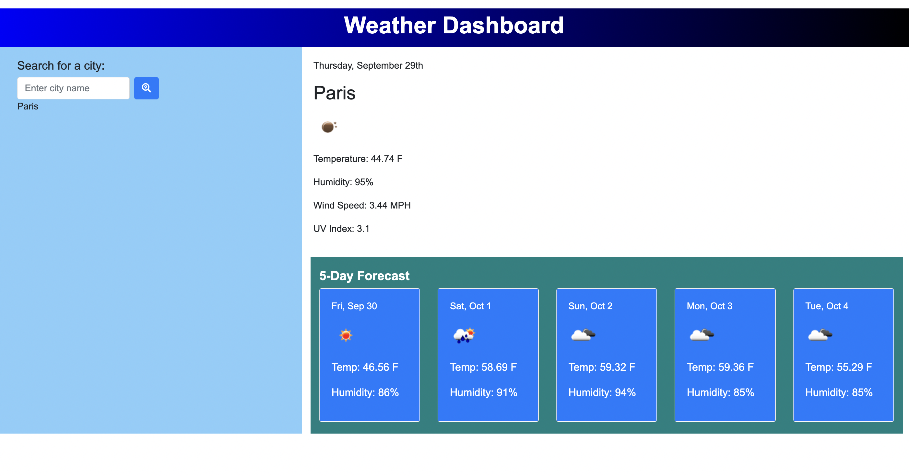

# Weather Dashboard

## Project Description
Weather Dashboard allow users to see the weather outlook for multiple cities. The application has a search feature where the user can search for a city and view current weather conditions for that city. This user friendly weather forecast application uses icons to represent the weather conditions, and displays the date, the temperature, the humidity and the wind speed.

## Technologies Used
* Third party APIs (jQuery, jQuery moment, Bootstrap)
* HTML5
* CSS3
* JavaScript

## Mockup

## Link to deployed application
https://sanam1060.github.io/weather-dashboard/